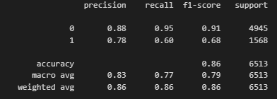
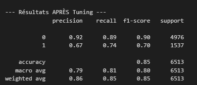

# Adult Census Income Prediction
Ce projet vise à prédire si un individu gagne plus de 50 000 $ par an en se basant sur des données socio-économiques issues du recensement de 1994.

Le dataset que nous avons choisi est "Adult Census Income" vous pouvez le retrouver sur ce lien (https://www.kaggle.com/datasets/uciml/adult-census-income/data)

**Objectif :** Prédire la variable cible income (classification binaire : <=50K ou >50K).
* **Type de problème :** Classification supervisée sur des données tabulaires mixtes.

Version de Python : 3.12.0

``` python
import kagglehub
import pandas as pd
import os

# 1. Télécharger la dernière version du dataset
path = kagglehub.dataset_download("uciml/adult-census-income")

print("Chemin vers les fichiers du dataset :", path)

# 2. Lister les fichiers pour trouver le nom exact du CSV
files = os.listdir(path)
print("Fichiers disponibles :", files)

# 3. Charger le fichier CSV dans un DataFrame Pandas
file_path = os.path.join(path, "adult.csv")
df = pd.read_csv(file_path)

# 4. Affichage des premières lignes pour faire nos prmeier tests sur ce dataset
print(df.head())
```
### Installation et environnement
Créer un environnement virtuel Python puis installer les dépendances donnée dans le requirements.txt
##### Instructions d’installation
``` bash
python -m venv venv
venv\Scripts\activate
python -m pip install --upgrade pip
pip install -r requirements.txt
```

### Reproduire les résultats
##### Ordre exact d’exécution des notebooks/scripts
Pour éxecuter les notebooks il suffit de suivre les numéros que nous avons mis en amont de chaque numéro de fichier 
### Résumé EDA
###### Analyse Univariée et Distributions
L'analyse initiale a permis d'identifier la structure globale du dataset, composé de 48 842 observations. Les variables numériques présentent des distributions variées : l'âge moyen se situe autour de 38 ans, tandis que les variables financières comme capital-gain et capital-loss sont fortement asymétriques avec une immense majorité de valeurs à zéro. Un point de vigilance a été soulevé concernant la variable cible income, qui présente un déséquilibre significatif avec environ 76 % de la population gagnant moins de 50 000 $ par an, ce qui a directement orienté le choix de nos métriques d'évaluation pour la modélisation.

###### Analyse Bivariée et Facteurs de Revenu
L'étude des relations entre les caractéristiques et la cible a révélé des prédicteurs très marqués. Le niveau d'éducation numérique (educational-num) est l'un des facteurs les plus discriminants : la probabilité de dépasser les 50k augmente drastiquement pour les individus ayant un score supérieur à 12. De même, l'âge joue un rôle crucial, montrant que les hauts revenus se concentrent principalement chez les actifs de 35 à 55 ans. L'analyse a également mis en lumière des disparités sociales, notamment une proportion de hauts revenus nettement plus élevée chez les hommes que chez les femmes dans ce jeu de données.

###### Analyse Multivariée et Interactions
En poussant l'analyse vers les interactions entre variables, nous avons constaté que le volume horaire hebdomadaire (hours-per-week) influence positivement le revenu, mais de manière différente selon le genre : les hommes à hauts revenus travaillent en moyenne plus d'heures que les femmes de la même catégorie. La matrice de corrélation a confirmé une faible redondance entre les variables numériques, à l'exception du lien logique entre le niveau d'étude et le score éducatif. Enfin, l'analyse par métier (occupation) a montré que les postes de cadres et de spécialistes dépassent largement la moyenne globale de revenus, confirmant que le secteur d'activité est un multiplicateur de richesse majeur dans ce recensement.

###### Synthèse pour la Modélisation
Cette phase d'exploration a permis de valider plusieurs choix techniques pour la suite du projet. La présence de valeurs manquantes dissimulées sous la forme de caractères "?" dans les colonnes workclass et occupation a nécessité un traitement spécifique. Les insights tirés de l'importance des variables (âge, éducation, statut marital) ont servi de base pour justifier l'utilisation d'un modèle de Random Forest, capable de capturer ces interactions complexes et non-linéaires identifiées visuellement lors des tests.
### Résumé de modélisation
##### Modèles entraînés
Comme nous sommes dans un dataset de classification nous avons fait le choix d'utiliser 3 modèles : Regression Logistique, Gradient Boosting et Random Forest.

##### Tableau des métriques
Regression Logistique : 

Gradient Boosting : 

Random Forest : 

##### Modèle final choisi + justification
Comme on peut le voir dans les tableaux au dessus nous avons choisis de concerver le modèle de random forest qui a une meilleur prédiction de notre evenement avoir un plus gros salaire avec une probabilité de 74% contre 60%  pour les autres. 

### Résumé du tuning d’hyperparamètres
L'objectif du tuning était de dépasser les performances du modèle de base (Baseline) en ajustant finement les paramètres structurels de la forêt aléatoire. Pour ce faire, nous avons utilisé la méthode GridSearchCV, qui consiste à tester de manière exhaustive toutes les combinaisons possibles au sein d'un espace de recherche prédéfini. Cette recherche a été couplée à une validation croisée à 5 plis (5-fold CV) afin de garantir que les améliorations de performance soient statistiquement robustes et non dues au hasard du découpage des données. 
L'optimisation a permis d'ajuster le comportement du modèle face au déséquilibre des classes (75% de revenus bas vs 25% de revenus hauts). En utilisant le score F1 comme métrique de référence, les résultats finaux montrent une évolution stratégique. Evolution du modèle de 60 à 74% ainsi qu'une amélioration du score f1 0.65 à 0.7 puis une baisse du compromis de précision  passant de 0.72 à 0.67.
Ce tuning a transformé un modèle initialement trop conservateur en un outil de prédiction beaucoup plus sensible et efficace pour détecter la classe minoritaire. Le modèle final est désormais mieux équilibré, offrant une capacité de détection des hauts revenus nettement supérieure tout en conservant une précision globale très satisfaisante de 85% sur l'ensemble du dataset.
### Section analyse d’erreurs
### Explication de la structure du projet
### Limites / pistes d’amélioration
Les limites du projet sont le dataset car il concerne des anciennes données qui ne sont peut etre plus à jours (1994). Beaucoup d'information se base sur d'ancien préjugé et refaire la même analyse avec l'emergence de nos nouveaux métiers serait très interressant et donnerai surement des résultats très différents de ceux obtenus. 

L'essaie d'autre modèle peut aussi être une piste intéressante pour continuer nos tests et trouver un meilleurs score de précision 
